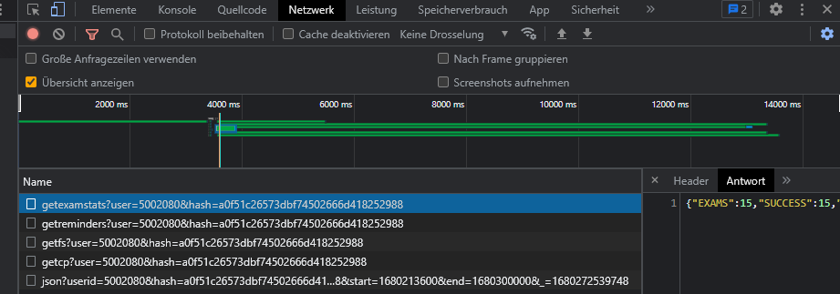

<h1>cs21-2-schedule</h1>
<hr><p>This is a project that makes it easier for us students to access our schedule for our courses at the university. Our actual web application for this is trash and therefore we had to look for a better solution and create one ourselves.</p>
<h2>General Information</h2>
<hr><ul>
<li>Our scheduler crawls the data from our actual university webapp und displays it way faster and nicer.</li>
</ul><ul>
<li>This project was inspired by the poor condition of campus dual</li>
</ul>
<h2>User Login</h2>
<ul>
<li>Where to find hash?</li>
<p>1. Login on https://selfservice.campus-dual.de/ </p>
<p>2. Press F12 and open Network</p>
<p>3. Copy your hash </p>

</ul>


## Getting Started

---

This app is MERN **dockerized**, just note the following.

- Make sure Docker is installed on your system, if not: https://docs.docker.com/desktop/

- You need to create an .env on root of the app, witch includes the following (without some Docker Desktop versions may throw an error):
  ```
   export DOCKER_BUILDKIT=0
   export COMPOSE_DOCKER_CLI_BUILD=0
  ```
- To access the MongoDB you need the matching DB_URI (only **trusted** contributors) and create an .env on root of the server directory, which includes the following:
  ```
  DB_URI=...
  ```
- Make sure the ports in the app **match** the specified ports from the **Dockerfile** and **docker-compose.yml**.

- You can now start the app and create your **client and - server-side containers** with the following command:
  ```
  docker-compose up --build
  ```
  **_NOTE:_** If you do not want to run it via docker, of course you can also run it locally.

<h2>Technologies Used</h2>
<hr><ul>
<li>JavaScript</li>
</ul><ul>
<li>TypeScript</li>
</ul><ul>
<li>React</li>
</ul><ul>
<li>Syncfusion</li>
</ul><ul>
<li>Vite</li>
</ul><ul>
<li>React</li>
</ul><ul>
<li>Bulma</li>
</ul><ul>
<li>NodeJS</li>
</ul><ul>
<li>Express</li>
</ul><ul>
<li>MongoDB</li>
</ul><h2>Setup</h2>
<hr><p>No requirements besides an internet capable device</p><h5>Steps</h5><ul>
<li>Just go to https://cs21-2-schedule.de/ - it's a web app :)</li>
</ul><h2>Project Status</h2>
<hr><p>In Progress</p><h2>Improvements</h2>
<hr><ul>
<li>Read our code, find issues and fix them or just be creative and develop new features :)</li>
</ul><h2>Acknowledgement</h2>
<hr><ul>
<li>Admin: Felix Herpich</li>
</ul><ul>
<li>Developers: Marc Wegeleben, Simon Nikolaidis</li>
</ul><ul>
<li>Thanks to: Florian Schmidt, Fritz Schubert</li>
</ul>
